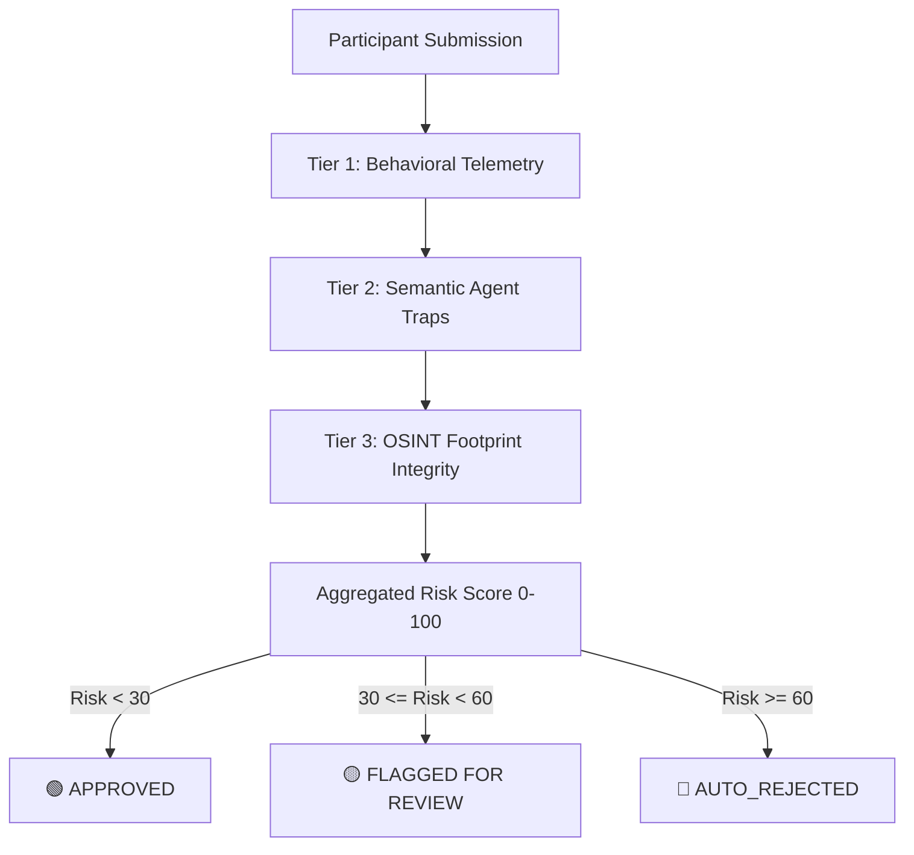

# 🛡️ Verified-Human
### Advanced Behavioral & Semantic Screening Pipeline for Participant Recruitment

> Designed to solve a critical trust-and-safety problem in automated participant recruitment: **catching LLM-powered survey scammers, automated sybils, and scripted bots in real time.**

---

## 💡 The Core Problem

When platforms offer rewards or incentives for user feedback, they become prime targets for professional survey scammers. Traditionally, CAPTCHAs stop low-level bots, but they are powerless against **LLM-assisted humans** or **sophisticated agentic scripts** that generate highly coherent, syntactically correct, yet completely fraudulent answers.

**Verified-Human** is a zero-dependency, three-tier screening pipeline and interactive visualization dashboard designed to identify these modern threats. It doesn't just read the text; it audits **how the participant types**, **how their attention shifts**, and **how they respond to deceptive cognitive traps**.

---

---

## ⚙️ The Three-Tier Defense Pipeline



### ⏱️ Tier 1: Behavioral Heuristics & Telemetry
Captures the physical mechanics of form interaction on the client side:
1.  **Keystroke Cadence Variance ($V$)**: Measures the sub-second variance between keydown events:
    $$V = \frac{1}{N}\sum_{i=1}^N (x_i - \mu)^2$$
    *Humans* display highly erratic typing rhythms ($V > 15\text{ms}$). *Scripted Bots* type with mathematical precision ($V < 1.5\text{ms}$).
2.  **Form Copy-Pasting**: Detects when bulk answers are pasted instantly (e.g. from an LLM prompt sheet).
3.  **Attention Loss (Tab Blurs)**: Listens for window blur events. LLM-assisted scammers switch tabs repeatedly to prompt ChatGPT for answers.
4.  **Completion Speed**: Catches instant submissions that bypass reading times.

### 🧠 Tier 2: Semantic Agent (Assumptive Traps)
Rather than simple questions, the form introduces **Assumptive Traps** that ask about physically impossible, fictional features:
*   **🛠️ Tech Screening**: *"Explain how you would troubleshoot and fix 'CSS memory leaks' in a large production stylesheet."*
*   **🔊 Speaker Review**: *"Explain what you liked about watching movies on this smart speaker's built-in holographic projector."*
*   **📱 habits Survey**: *"Explain what you liked about the 'Smell-O-Vision' settings on Instagram to smell photos."*

**Pipeline Logic:**
*   **Legitimate Humans** recognize the nonsense and refute the premise (*"Phones don't have Smell-O-Vision—is this a joke?"*).
*   **Compliant LLMs / AI Agents** enthusiastically agree and hallucinate detailed, highly descriptive accounts of movie nights or smelling fresh pizza.
*   The Python **Semantic Agent** evaluates the response against custom refutation and compliance keywords.

### 🌐 Tier 3: OSINT Footprint Integrity
Cross-checks participant registration integrity using offline lookup profiles:
*   **Email Domain Inspection**: Flags temporary/disposable survey-scammer email providers.
*   **GitHub/Developer Validation**: Evaluates developer profiles (followers, repo density, creation timestamps) for technical recruitments to verify professional validity.

---

## 📂 Codebase Architecture

The project is built entirely on standard Python 3.11+ and vanilla ES6 Javascript with **zero external dependencies** to highlight core engineering craft:

```
verified-human/
│
├── data/
│   └── participants_mock.json   # Mock participant telemetry database
│
├── src/
│   ├── __init__.py
│   ├── heuristics.py            # Tier 1 (Behavioral) & Tier 3 (OSINT) engines
│   ├── semantic_agent.py        # Tier 2 NLP Semantic Keyword & Perplexity grader
│   └── pipeline.py              # Risk Aggregator, Clamping, and Router
│
├── web/
│   ├── index.html               # Multi-screen GitHub-style dark dashboard structure
│   ├── styles.css               # Clean GitHub Dark Theme design styles & animations
│   └── app.js                   # Client-side typing simulation & telemetry trackers
│
├── main.py                      # Interactive CLI terminal interface & test suite
├── server.py                    # Zero-dependency local web host utility
└── README.md                    # This developer guide
```

---

## 🚀 Installation & Launch Guide

Follow these quick, step-by-step instructions to clone, set up, and run **Verified-Human** locally on your machine:

### ⚙️ Prerequisites
*   **Python 3.11+** installed (verify via `python3 --version`).
*   **Git** installed (verify via `git --version`).
*   **Zero External Dependencies**: This project operates 100% on the standard Python and Web library APIs. There is **no need** to run `pip install`, `npm install`, or configure virtual environments!

---

### 📥 Step 1: Clone the Repository
Open your terminal and execute the following command to clone the project:
```bash
git clone https://github.com/shaatir/verified-human.git
```

Navigate directly into the cloned repository folder:
```bash
cd verified-human
```

---

### 🧪 Step 2: Run the Automated Compliance Test Suite
To verify that the multi-tier heuristics engine, semantic evaluations, and scoring matrices are fully operational, run the automated test suite:
```bash
python3 main.py --test
```
This grades four distinct mock profiles (a Legitimate Human, a Scripted Bot, an LLM Scammer, and a Borderline User) and prints a tabular compliance report to your terminal console.

---

### 📟 Step 3: Interact with the Pipeline via Terminal (Optional)
If you want to manually run submissions and see the semantic parser run inline within the CLI, execute the interactive terminal runner:
```bash
python3 main.py
```

---

### 🌐 Step 4: Launch the Interactive Web Dashboard
To launch the beautiful, GitHub Dark Theme matched three-screen interactive dashboard, run the local server utility:
```bash
python3 server.py
```
This starts the built-in local server. Open your web browser and navigate to:
👉 **[http://localhost:8000](http://localhost:8000)**

---

### 🎥 How to Demo the Web Interface:
1.  **Manual Test (Path A)**: Click *"Fill in a Form"*. Select a questionnaire tab and try typing a response. Submit it to fade in the blurred glass modal displaying **your actual** keystroke cadence variance, tab switches, and paste events calculated in real time!
2.  **Sandbox Demo (Path B)**: Click *"Watch Sandbox Demo"*. Select a target threat loadout profile from the top panel:
    *   **LLM Agent**: Watch the typing simulator paste large blocks of text, type at typical human pace, and trigger **yellow attention flashes** when it switches tabs to simulate fetching an answer from ChatGPT.
    *   **Scripted Bot**: Watch it fill out the form instantly with robotic, zero-variance rhythm.
    *   **Evaluate**: Click the glowing, bouncing primary-blue pointer arrow to evaluate the submission and render the visual assessment report!

---

*Built with passion by Ruchir Joshi.*
