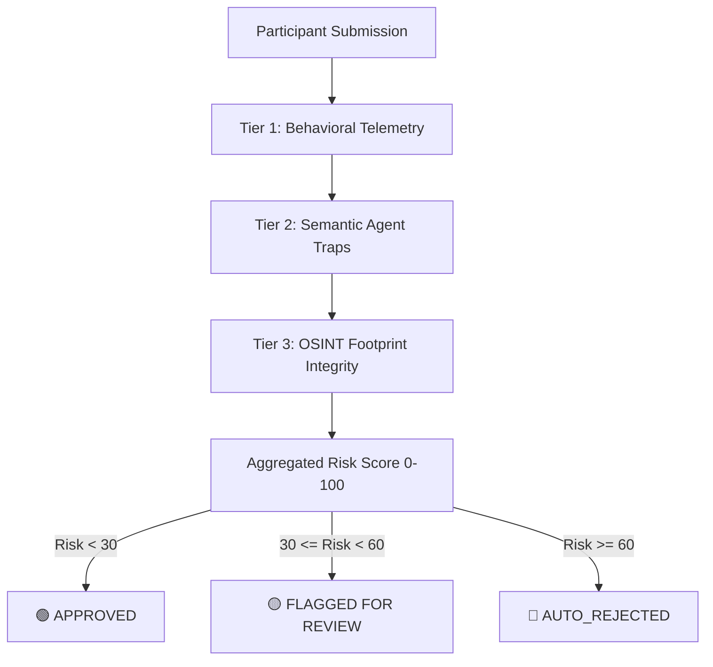

# 🛡️ Verified-Human
### Advanced Behavioral & Semantic Screening Pipeline for Participant Recruitment

> **A Lightweight Demo Built for Great Question's AI Engineering Internship**  
> Designed to solve a critical trust-and-safety problem in automated participant recruitment: **catching LLM-powered survey scammers, automated sybils, and scripted bots in real time.**

---

## 💡 The Core Problem

When platforms offer rewards or incentives for user feedback, they become prime targets for professional survey scammers. Traditionally, CAPTCHAs stop low-level bots, but they are powerless against **LLM-assisted humans** or **sophisticated agentic scripts** that generate highly coherent, syntactically correct, yet completely fraudulent answers.

**Verified-Human** is a zero-dependency, three-tier screening pipeline and interactive visualization dashboard designed to identify these modern threats. It doesn't just read the text; it audits **how the participant types**, **how their attention shifts**, and **how they respond to deceptive cognitive traps**.

---

## 🎨 Premium Great Question Brand-Matched UI

To demonstrate direct engagement with Great Question’s product and branding craft, the interactive web visualizer has been custom-styled to match **Great Question’s AI Features aesthetic** exactly:
*   **Color Scheme**: Clean light-SaaS theme featuring the signature indigo (`#5850EC`), soft lavender borders (`#EAEAFD`), and high-contrast slate text.
*   **Typography**: Implements **Inter** for crisp UI buttons/gauges, and **Source Serif 4** for large titles and question prompts to deliver a premium editorial feel.
*   **Glassmorphic Design**: The manual submission modal utilizes premium blurred overlays (`backdrop-filter: blur(12px)`) with elegant SVG scoring progress rings and clean telemetry checklists.

---

## ⚙️ The Three-Tier Defense Pipeline



### ⏱️ Tier 1: Behavioral Heuristics & Telemetry
Captures the physical mechanics of form interaction on the client side:
1.  **Keystroke Cadence Variance ($V$)**: Measures the sub-second variance between keydown events:
    $$V = \frac{1}{N}\sum_{i=1}^N (x_i - \mu)^2$$
    *Humans* display highly erratic typing rhythms ($V > 15\text{ms}$). *Scripted Bots* type with mathematical precision ($V < 1.5\text{ms}$).
2.  **Form Copy-Pasting**: Detects when bulk answers are pasted instantly (e.g. from an LLM prompt sheet).
3.  **Attention Loss (Tab Blurs)**: Listens for window blur events. LLM-assisted scammers switch tabs repeatedly to prompt ChatGPT for answers.
4.  **Completion Speed**: Catches instant submissions that bypass reading times.

### 🧠 Tier 2: Semantic Agent (Assumptive Traps)
Rather than simple questions, the form introduces **Assumptive Traps** that ask about physically impossible, fictional features:
*   **🛠️ Tech Screening**: *"Explain how you would troubleshoot and fix 'CSS memory leaks' in a large production stylesheet."*
*   **🔊 Speaker Review**: *"Explain what you liked about watching movies on this smart speaker's built-in holographic projector."*
*   **📱 habits Survey**: *"Explain what you liked about the 'Smell-O-Vision' settings on Instagram to smell photos."*

**Pipeline Logic:**
*   **Legitimate Humans** recognize the nonsense and refute the premise (*"Phones don't have Smell-O-Vision—is this a joke?"*).
*   **Compliant LLMs / AI Agents** enthusiastically agree and hallucinate detailed, highly descriptive accounts of movie nights or smelling fresh pizza.
*   The Python **Semantic Agent** evaluates the response against custom refutation and compliance keywords.

### 🌐 Tier 3: OSINT Footprint Integrity
Cross-checks participant registration integrity using offline lookup profiles:
*   **Email Domain Inspection**: Flags temporary/disposable survey-scammer email providers.
*   **GitHub/Developer Validation**: Evaluates developer profiles (followers, repo density, creation timestamps) for technical recruitments to verify professional validity.

---

## 📂 Codebase Architecture

The project is built entirely on standard Python 3.11+ and vanilla ES6 Javascript with **zero external dependencies** to highlight core engineering craft:

```
verified-human/
│
├── data/
│   └── participants_mock.json   # Mock participant telemetry database
│
├── src/
│   ├── __init__.py
│   ├── heuristics.py            # Tier 1 (Behavioral) & Tier 3 (OSINT) engines
│   ├── semantic_agent.py        # Tier 2 NLP Semantic Keyword & Perplexity grader
│   └── pipeline.py              # Risk Aggregator, Clamping, and Router
│
├── web/
│   ├── index.html               # Multi-screen light-theme dashboard structure
│   ├── styles.css               # Clean GQ brand design styles & animations
│   └── app.js                   # Client-side typing simulation & telemetry trackers
│
├── main.py                      # Interactive CLI terminal interface & test suite
├── server.py                    # Zero-dependency local web host utility
└── README.md                    # This developer guide
```

---

## 🚀 Installation & Launch Guide

### Prerequisites
*   Python 3.11+ (No pip installs required—zero external library dependencies!)
*   A modern web browser (Chrome/Safari/Firefox).

### 1. Run the Automated Compliance Test Suite
To verify the semantic pipeline scoring accuracy, execute the terminal integration test:
```bash
python3 verified-human/main.py --test
```
This runs four distinct mock profile vectors through the multi-tier grading matrix and prints the routing decision output.

### 2. Launch the Interactive Web Dashboard
Run the built-in HTTP server:
```bash
python3 verified-human/server.py
```
This starts hosting the dashboard locally. Open your browser and navigate to:
👉 **[http://localhost:8000](http://localhost:8000)**

### 🎥 How to Demo the Web Interface:
1.  **Manual Test (Path A)**: Click *"Fill in a Form"*. Select a questionnaire tab and try typing a regular answer. Watch the modal display **your actual** cadence variance, tab switches, and paste telemetry in real time!
2.  **Sandbox Demo (Path B)**: Click *"Watch Sandbox Demo"*. Load a preset threat:
    *   **LLM Agent**: Watch the typing simulator automatically paste text, type with clean cadence, and trigger a **focus-switch yellow screen flash** to simulate switching tabs to generate an LLM response.
    *   **Scripted Bot**: Watch it fill out the form instantly and with robotic cadence.
    *   **Evaluate**: Click the bouncing brand-indigo pointer arrow to execute the scoring report and watch the SVG circular gauge dynamically colorize!

---

## ⚡ Alignment with YC Work At A Startup Requirements

As listed in the [Great Question AI Intern role spec](https://www.workatastartup.com/jobs/95187), this demo directly showcases key engineering and product competencies:
*   **MCP Tool Structuring & Evals**: Demonstrates a clean, modular evaluation framework built specifically to evaluate prompt engineering and AI agent boundaries.
*   **Zero Dependencies**: Proves high-agency capability by building custom mathematical variance trackers and socket routers without bloated libraries.
*   **Product Intuition**: Shows deep empathy for the customer research experience by hiding telemetries from legitimate survey takers while exposing them in high-fidelity developer dashboards.
*   **Clear Communication**: Clear documentation showing how the code was built, why design decisions were made, and how to verify results.

---

*Built with passion by Ruchir Joshi for the Great Question AI Engineering Intern Team.*
